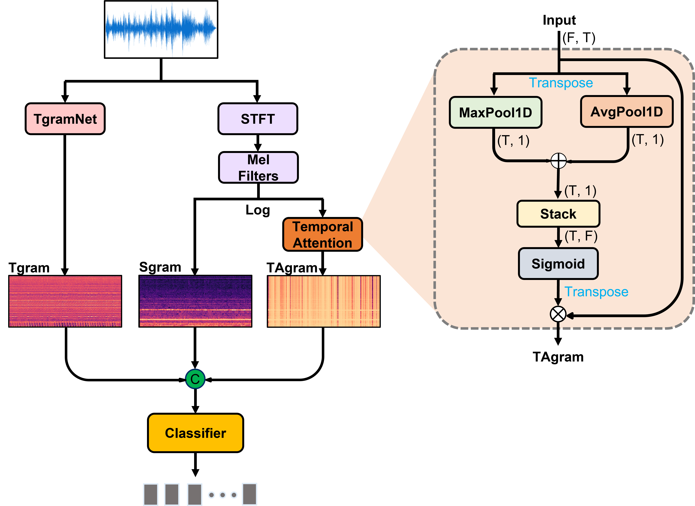
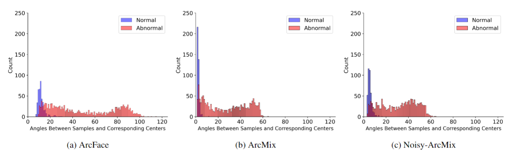

## Noisy-ArcMix / TASTgram-MFN (Pytorch Implementation)
By Soonhyeon Choi (csh5956@kaist.ac.kr) at 
Korea Advanced Institute of Science and Technology (KAIST)

## Introduction
Noisy-ArcMix significantly improve the compactness of intra-class distribution through the training with virtually synthesized samples near the normal data distribution. More importantly, we observed that the mingling effect between normal and anomalous samples can be reduced further by Noisy-ArcMix, which gains generalization ability through the use of inconsistent angular margins for the corrupted label prediction. In addition to Noisy-ArcMix, we introduce a new input feature, temporally attended log-Mel spectrogram (TAgram), derived from a temporal attention block. TAgram includes the temporal attention weights broadcasted to spectrogram features, which helps a model to focus on the important temporal regions for capturing crucial features.
<br/>
This repository contains the implementation used for the results in our paper <Link>.

## TASTgram Architecture

<p align="center">
  
</p>

The overall architecture of TASTgram. The temporal feature (Tgram) extracted from the raw wave through a CNN-based TgramNet is concatenated with the log-Mel spectrogram (Sgram) and a global temporal feature (TAgram) obtained from the temporal attention block.


## Noisy-ArcMix

<p align="center">
  
</p>
Histogram with the distribution of angles between samples and their corresponding centers for the Fan machine type in cases of (a) ArcFace, (b) ArcMix, and (c) Noisy-ArcMix.

## Datasets

[DCASE2020 Task2](https://dcase.community/challenge2020/task-unsupervised-detection-of-anomalous-sounds) Dataset: 
+ [development dataset](https://zenodo.org/record/3678171)
+ [additional training dataset](https://zenodo.org/record/3727685)
+ [Evaluation dataset](https://zenodo.org/record/3841772)


## Organization of the files

```shell
├── check_points/
├── datasets/
    ├── fan/
        ├── train/
        ├── test/
    ├── pump/
        ├── train/
        ├── test/
    ├── slider/
        ├── train/
        ├── test/
    ├── ToyCar/
        ├── train/
        ├── test/
    ├── ToyConveyor/
        ├── train/
        ├── test/
    ├── valve/
        ├── train/
        ├── test/
├── model/
├── Dockerfile
├── README.md
├── config.yaml
├── LICENSE
├── dataloader.py
├── eval.py
├── losses.py
├── train.py
├── trainer.py
├── utils.py
```

## Training
Check the `config.yaml` file to select a training mode from ['arcface', 'arcmix', 'noisy_arcmix']. Default is noisy-arcmix. 
<br/>
Use `python train.py` to train a model. 
```
python train.py
```

## Evaluating
Use `python eval.py` to evaluate the trained model.
```
python eval.py
```

## Model weights
Our trained model weights file can be accessed in https://drive.google.com/drive/folders/1tuUS-MKcAy-jFDVVdD5rpy-NU-3Pk46a?hl=ko.

## Experimental Results
 | machine Type | AUC(%) | pAUC(%) | mAUC(%) |
 | --------     | :-----:| :----:  | :----:  |
 | Fan          | 98.32  | 95.34   | 92.67   |
 | Pump         | 95.44  | 85.99   | 91.17   |
 | Slider       | 99.53  | 97.50   | 97.96   |
 | Valve        | 99.95  | 99.74   | 99.89   |
 | ToyCar       | 96.76  | 90.11   | 88.81   |
 | ToyConveyor  | 77.90  | 67.15   | 68.18   |
 | __Average__      | __94.65__  | __89.31__   | __89.78__   |


## Citation
If you use this method or this code in your paper, then pleas cite it:
